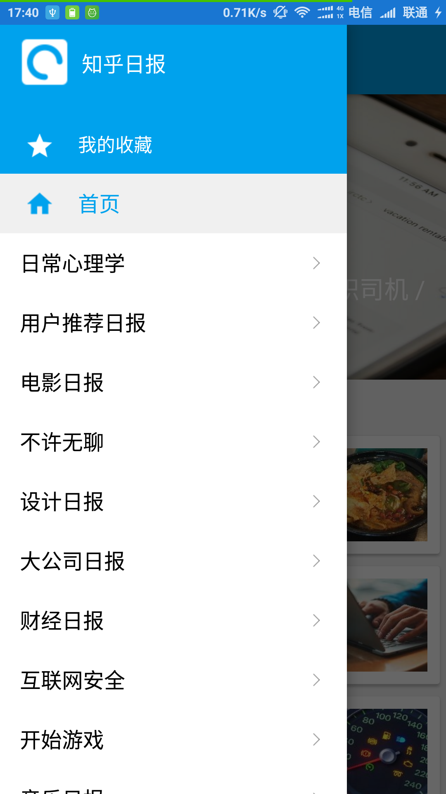

### ZhihuDaily 
ZhihuDaily for Kotlin,[说明请看这里](http://www.jianshu.com/p/1114c471281b)

### Dev
- Android-Studio: 3.0
- Java version: 1.8
- Kotlin version: 1.1.3
- SDK Tool: 25.0.2


### Points
- MVP
- dagger2(v2.11)
- rx
- room
- Anko

### Screenshot

<body bgcolor="#f0f0f0">
<p>
&nbsp;&nbsp;&nbsp;
</p>
<body bgcolor="#f0f0f0">
<p>
&nbsp;&nbsp;&nbsp;&nbsp;&nbsp;&nbsp;&nbsp;&nbsp;&nbsp;&nbsp;&nbsp;&nbsp;&nbsp;&nbsp;&nbsp;

</p>
<body bgcolor="#f0f0f0">
<p>
&nbsp;&nbsp;&nbsp;&nbsp;&nbsp;&nbsp;&nbsp;&nbsp;&nbsp;&nbsp;&nbsp;&nbsp;&nbsp;&nbsp;&nbsp;

</p>
<p>

</p>
</body>


### Download


---

### Licence

```
Copyright 2017 JokAr

Licensed under the Apache License, Version 2.0 (the "License");
you may not use this file except in compliance with the License.
You may obtain a copy of the License at

   http://www.apache.org/licenses/LICENSE-2.0

Unless required by applicable law or agreed to in writing, software
distributed under the License is distributed on an "AS IS" BASIS,
WITHOUT WARRANTIES OR CONDITIONS OF ANY KIND, either express or implied.
See the License for the specific language governing permissions and
limitations under the License.
```